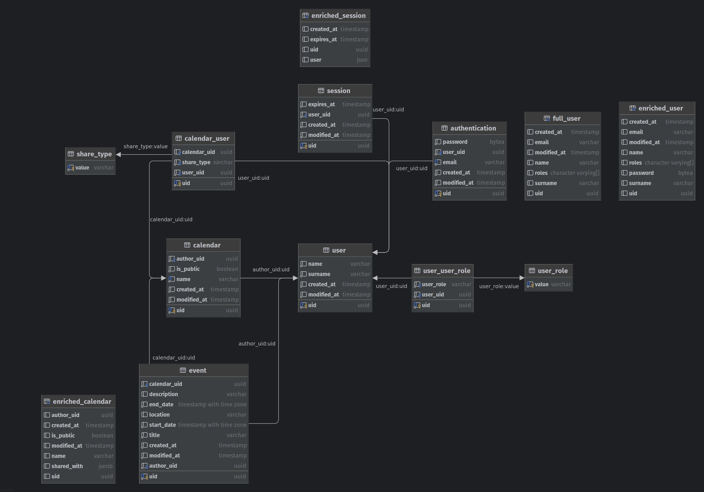

# PK Calendar

[](https://www.gnu.org/licenses/gpl-3.0)

## Table of Contents

- [Install](#install)
- [Usage](#usage)
- [Project Structure](#project-structure)
- [Maintainers](#maintainers)
- [Contributing](#contributing)
- [License](#license)

## Install

This project uses [npm](https://www.npmjs.com/) for package management.

```bash
# from the root of the monorepo
npm install
```

## Usage

| Command             | Description                                                           |
|---------------------|-----------------------------------------------------------------------|
| `docker compose up` | Start all services in production mode using Docker Compose            |
| `npm run build`     | Build all applications and packages for production                    |
| `npm run lint`      | Lint the code in all applications and packages                        |
| `npm run lint:fix`  | Lint the code in all applications and packages and fix issues         |
| `npm run serve`     | Start the development server for all applications                     |
| `npm run typecheck` | Type check the code in all applications and packages using TypeScript |

### Docker

Before starting the services, create a `.env` file in the root directory with the following variables:

```env
AUTH_SEED=<random-string>               # required; password hash seed, should be an alphanumeric string of 16-64 characters
AUTH_ADMIN_PASSWORD=<admin-password>    # optional; admin user password (default: 'q')
PG_PASSWORD=<database-password>         # required; PostgreSQL root password
POSTGRES_PASSWORD=<database-password>   # required; must match PG_PASSWORD
```

> [!IMPORTANT]
> `PG_PASSWORD` and `POSTGRES_PASSWORD` must have the same value for the database connection to work.

When using `docker compose up`, all services are started in production mode.
The UI is available at `localhost:8080`.
\
Default credentials:

- Email: `admin.calendar@pk.edu.pl`
- Password: `$AUTH_ADMIN_PASSWORD`
  I'll add a section for local development. Here's the addition for the `README.md`:

### Local Development

For local development, you'll need to start the database container first:

```bash
docker build -f docker/database/Dockerfile -t pk-database . && \
docker run -d \
  -e POSTGRES_DB=pk \
  -e POSTGRES_PASSWORD=<database-password> \
  -e POSTGRES_USER=pk-admin \
  -p 6000:6000 \
  --name pk-database \
  pk-database
```

Then create a `apps/server/.env` file in the root directory with the following variables:

```env
AUTH_SEED=<random-string>              # required; password hash seed, should be an alphanumeric string of 16-64 characters
AUTH_ADMIN_PASSWORD=<admin-password>   # optional; (default: 'q')
PG_PASSWORD=<database-password>        # required; PostgreSQL root password
```

Start the services in development mode:

```bash
# start the server (available at localhost:5000)
npm run serve -w @pk/server

# start the UI (available at localhost:4000)
npm run serve -w @pk/ui

# or start everything at once
npm run serve
````

> [!NOTE]
> See [server docs](./apps/server/README.md#environment-variables) for additional environment variables.

## Project Structure

This is a monorepo managed with [Turborepo](https://turbo.build/repo). It contains the following packages:

### Apps

- [apps/server](./apps/server): Backend server that offers CRUD operations for calendars, events, sessions, and users
- [apps/timetable-parser-service](./apps/timetable-parser-service): Service that parses schedule from the university
  website
- [apps/ui](./apps/ui): Web UI that provides a frontend for managing calendars, events, and users

### Packages

- [packages/ts-config](./packages/ts-config): Shared TypeScript configuration
- [packages/timetable-parser](./packages/timetable-parser-core): Core functionality for schedule parsing
- [packages/types](./packages/types): Shared TypeScript types
- [packages/utils](./packages/utils): Shared utilities

### Database

PostgreSQL database for storing calendars, events, sessions, and users.

- [Dockerfile](./docker/database/Dockerfile): Dockerfile for PostgreSQL database
- [init.sql](./docker/database/init.sql): SQL scripts for creating tables and seeding the database



## Maintainers

This project is maintained by [Bartłomiej Wąś](https://github.com/KT-Trez).

## Contributing

Feel free to dive in! [Open an issue](https://github.com/KT-Trez/pk-monorepo/issues/new/choose) or submit PRs.

## License

[GPL-3.0-or-later](LICENSE) © Bartłomiej Wąś